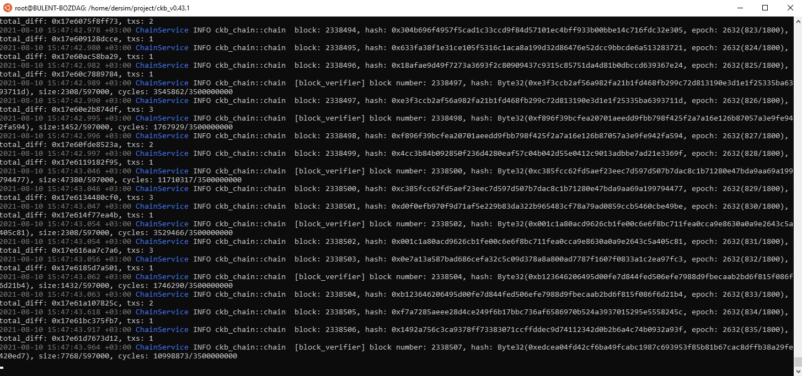

# nervos-testnet
Gitcoin: 0) Setup A Local CKB Node And CKB Indexer For The Testnet

1. Setup a CKB Node:

2. Setup a CKB Indexer

Gitcoin: 1) Create A Godwoken Account On The EVM Layer 2 Testnet

https://explorer.nervos.org/aggron/address/ckt1qyqr0ue8xd08g4n9thyrrrkuvhrtjet29rwsvfpkl0

Deposit 

Gitcoin: 2) Deploy A Simple Ethereum Smart Contract On Polyjuice

Transaction hash: 0x31b39ef655191bc84a7f79c0804f84e5d97c8b19c35a8cf8832f48f857bd3f27

Deployed contract address: 0x16C024484E7531338ce849b8621c4F15C2436e3d

Gitcoin: 3) Issue A Smart Contract Call To The Deployed Smart Contract

 transactionHash: 0xac91cc38caf6e69f71513722db348c1ee3e93d0b84a8b66285b3b35af6fddadf
 contract address: 0x16C024484E7531338ce849b8621c4F15C2436e3d
 
 
ABI:
 
[
    {
      "inputs": [],
      "stateMutability": "payable",
      "type": "constructor"
    },
    {
      "inputs": [
        {
          "internalType": "uint256",
          "name": "x",
          "type": "uint256"
        }
      ],
      "name": "set",
      "outputs": [],
      "stateMutability": "payable",
      "type": "function"
    },
    {
      "inputs": [],
      "name": "get",
      "outputs": [
        {
          "internalType": "uint256",
          "name": "",
          "type": "uint256"
        }
      ],
      "stateMutability": "view",
      "type": "function"
    }
]

Gitcoin: 4) Issue An SUDT Token On Layer 1 And Deposit It To Layer 2

1-A link to the Layer 1 address you funded on the Testnet Explorer:
https://explorer.nervos.org/aggron/address/ckt1qyqr0ue8xd08g4n9thyrrrkuvhrtjet29rwsvfpkl0

2-A screenshot of the console output immediately after using sudt-cli to create your SUDT tokens on Layer 1:

3-A link to the transaction ID created by sudt-cli on the Testnet Explorer:
https://explorer.nervos.org/aggron/transaction/0x47f3ed4f907b7b3803d78ab534f53d2591d717f7169ef51a1bbf3e7f008f4bb7

4-A screenshot of the console output immediately after you have successfully submitted a deposit to Layer 2 using the account-cli tool:

5-The SUDT ID from the console output after executing the deposit script (in text format).
1449
 
 

