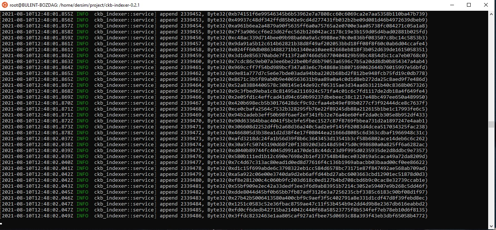

# nervos-testnet
Setup A Local CKB Node And CKB Indexer For The Testnet

1. Setup a CKB Node:

2. Setup a CKB Indexer

1) Create A Godwoken Account On The EVM Layer 2 Testnet

https://explorer.nervos.org/aggron/address/ckt1qyqr0ue8xd08g4n9thyrrrkuvhrtjet29rwsvfpkl0

Deposit 

