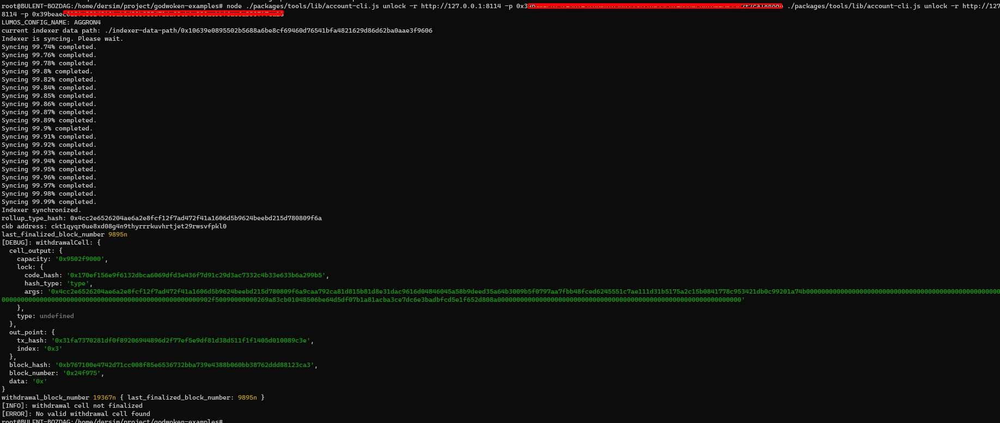

### A screenshot of the console output immediately after running the "unlock" command.

 
#### ETH address: 0xe36ee8026c907667B916ee8059508787497B0eE2

#### Nervos Layer 1 address: ckt1qyqr0ue8xd08g4n9thyrrrkuvhrtjet29rwsvfpkl0

