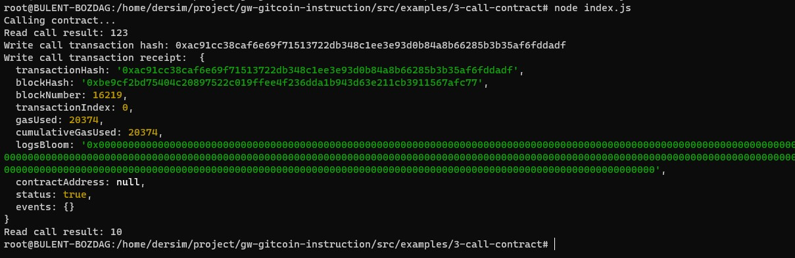

### Gitcoin: 3) Issue A Smart Contract Call To The Deployed Smart Contract

 transactionHash: 0xac91cc38caf6e69f71513722db348c1ee3e93d0b84a8b66285b3b35af6fddadf
 
 contract address: 0x16C024484E7531338ce849b8621c4F15C2436e3d
 
 
ABI:
 
[
    {
      "inputs": [],
      "stateMutability": "payable",
      "type": "constructor"
    },
    {
      "inputs": [
        {
          "internalType": "uint256",
          "name": "x",
          "type": "uint256"
        }
      ],
      "name": "set",
      "outputs": [],
      "stateMutability": "payable",
      "type": "function"
    },
    {
      "inputs": [],
      "name": "get",
      "outputs": [
        {
          "internalType": "uint256",
          "name": "",
          "type": "uint256"
        }
      ],
      "stateMutability": "view",
      "type": "function"
    }
]
