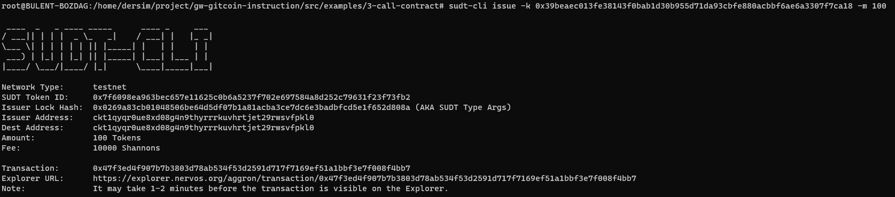
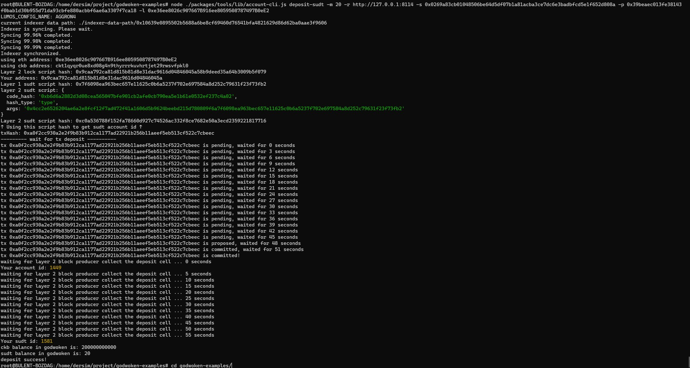

### Gitcoin: 4) Issue An SUDT Token On Layer 1 And Deposit It To Layer 2

1-A link to the Layer 1 address you funded on the Testnet Explorer:
https://explorer.nervos.org/aggron/address/ckt1qyqr0ue8xd08g4n9thyrrrkuvhrtjet29rwsvfpkl0

2-A screenshot of the console output immediately after using sudt-cli to create your SUDT tokens on Layer 1:

3-A link to the transaction ID created by sudt-cli on the Testnet Explorer:
https://explorer.nervos.org/aggron/transaction/0x47f3ed4f907b7b3803d78ab534f53d2591d717f7169ef51a1bbf3e7f008f4bb7

4-A screenshot of the console output immediately after you have successfully submitted a deposit to Layer 2 using the account-cli tool:

5-The SUDT ID from the console output after executing the deposit script (in text format).

Your sudt id: 1581
