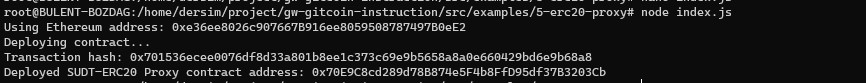
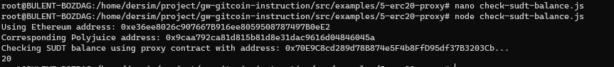

### Gitcoin: 5) Deploy The ERC20 Proxy Contract For The Deposited SUDT

Deployed SUDT-ERC20 Proxy contract address: 0x70E9C8cd289d78B874e5F4b8FfD95df37B3203Cb

Using Ethereum address: 0xe36ee8026c907667B916ee8059508787497B0eE2
