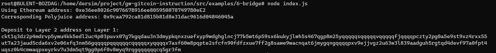

### Gitcoin: 6) Use Force Bridge To Deposit Tokens From Ethereum To Polyjuice

#### Deposit receiver address:
ckt1q3dz2p4mdrvp5ywu4kk5edl2uc4p03puvx07g7kgqdau3n3dmypkqnxzuefxyp9wdghglncj77k5wt6p59sx6kukyjlwh5s467qgp8m25yqqqqqsqqqqqvqqqqqfjqqqqpczty2pg0a5e9st9xz4rxx55ut7a23jaud5cda6xv2e06xfq3nm56gqqqqpqqqqqqcqqqqqxyqqqqx7asf60w8pqpte2sfcfn90fdfzxue7ff2g8sawe9wacnqat6jmygqngqqqqpxv9ejjvgz2u63w3l839aadguh5rgtqd4devf97a0fpt4uqsz0k4cmwaqpxeyrkv7u3dm5qt9gg0p6f0v8wyq9rqgqqqqqqcq5gr3fm

Ethereum address: 0xe36ee8026c907667B916ee8059508787497B0eE2

https://rinkeby.etherscan.io/tx/0x6d6d0a8ec0da36cb36e188c5dfb22bb8b636877f6dc94d86e5424ac4ad014b87

https://explorer.nervos.org/aggron/transaction/0x7dda98bbc4baab0e885457855261e5fa4fe31e7d4751d944e7423a2651a5ff34

