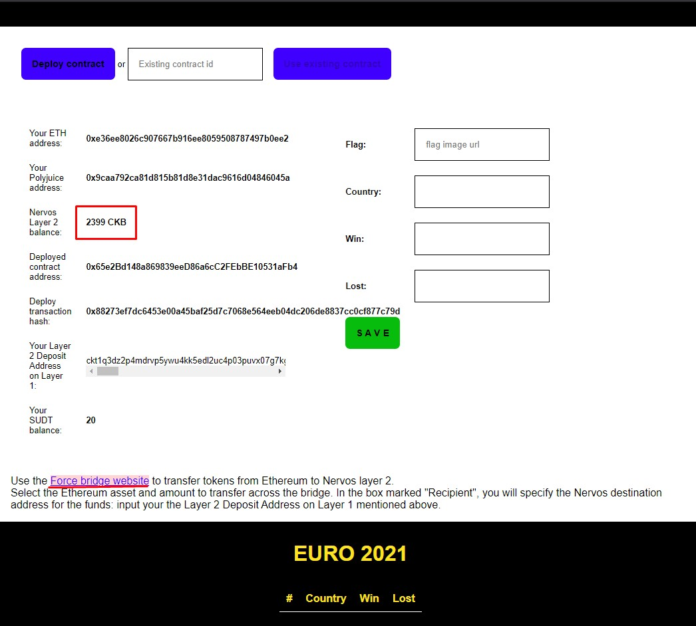
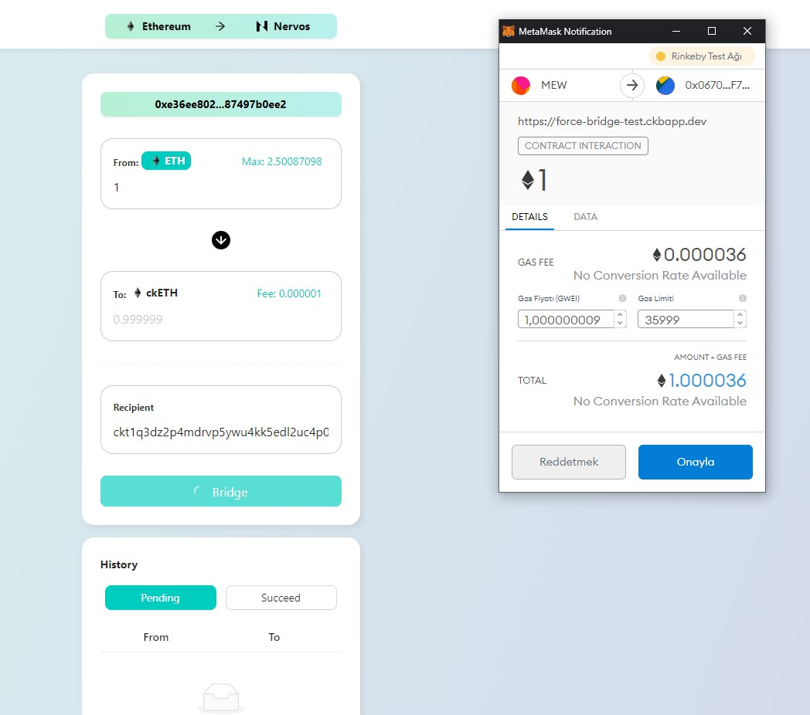
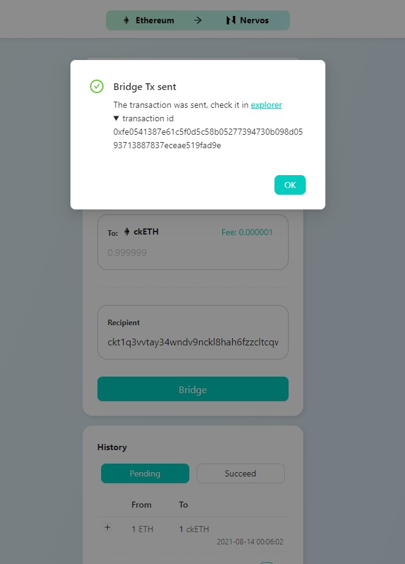
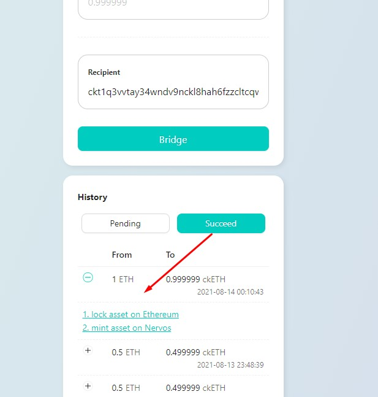
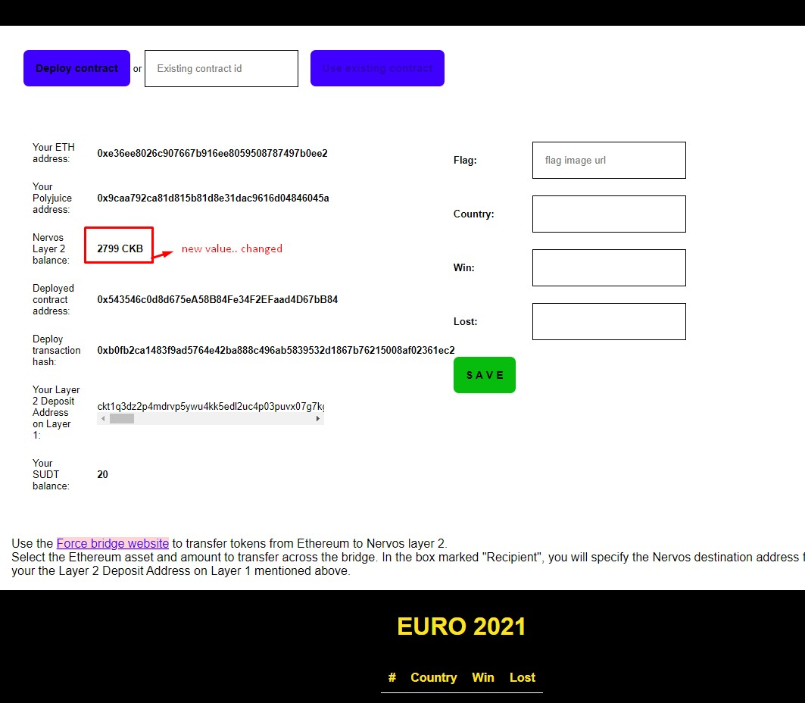

### Gitcoin: 8) Modify The Ported DApp So It Supports Ethereum Assets Via Force Bridge

#### 2) The address of the SUDT-ERC20 Proxy Contract that you deployed (in text format).

0x70E9C8cd289d78B874e5F4b8FfD95df37B3203Cb

----------

#### 3) A link to the GitHub repository with your EVM application that integrates Force Bridge support.

https://github.com/bulentbozdag/Scores-on-Blockchain-DAPPS

